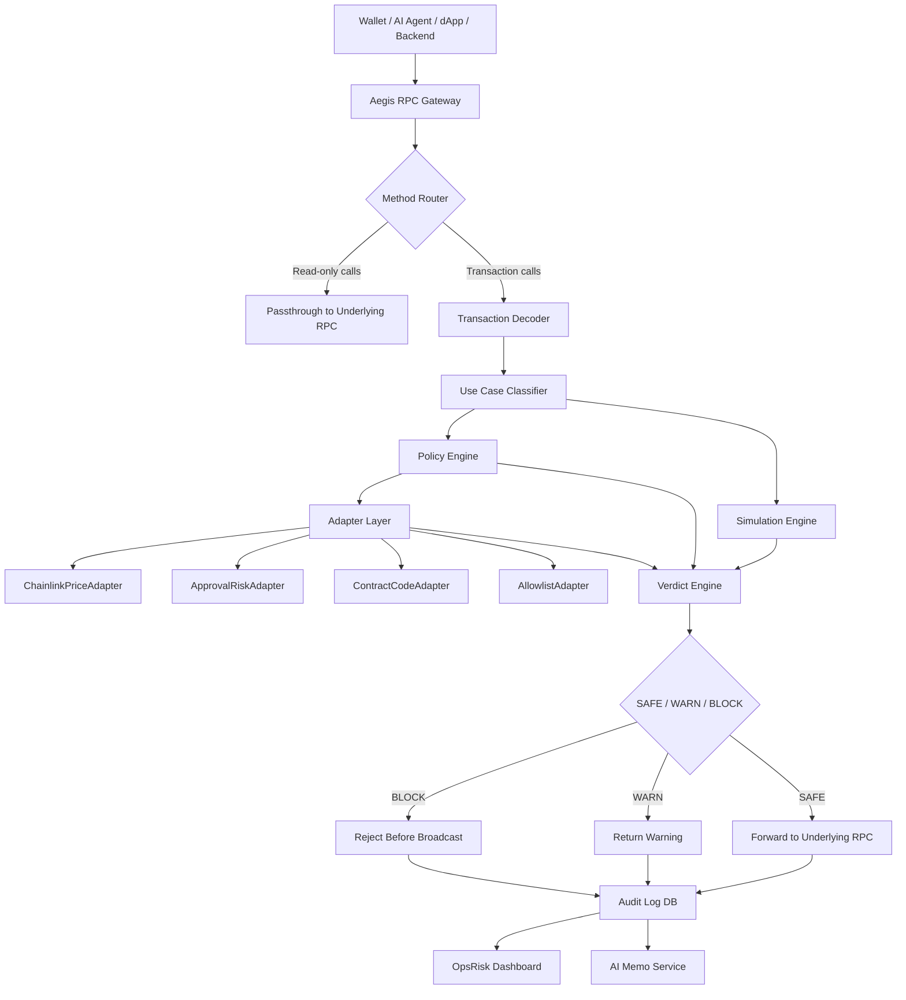

# AGENTS.md — Aegis RPC Agent-Swarm Instructions

## Mission

Build a hackathon-ready Aegis RPC MVP that proves **pre-broadcast transaction screening** across wallet, agent, DeFi, RWA/treasury, and protocol-backend workflows.

## Non-negotiable product truths

1. Aegis RPC is the product.
2. Chainlink is only the first real-data adapter using `AggregatorV3Interface`.
3. AI helps with suspicious-context summarization and explanation, but it never makes the final enforcement decision.
4. Deterministic policy engine produces the final `SAFE`, `WARN`, or `BLOCK`.
5. RiskOps dashboard is the operational proof surface, not the product core.
6. The hackathon MVP is a wrapped RPC gateway, not a full RPC node.
7. Do not claim Aegis prevents all hacks or detects all zero-days.
8. Do not make the project only about AI agents; agents are one use-case template.
9. Do not make the project only about Chainlink; Chainlink is one adapter.
10. Do not overbuild. Build the smallest reliable product that can be demoed.

## Judging criteria target

| Criterion | Build evidence |
|---|---|
| Originality 30% | RPC becomes programmable screening checkpoint before broadcast. |
| Problem-Solving 30% | Blocks wallet-drainer approvals and out-of-policy agent/DeFi/RWA actions before broadcast. |
| Completeness 20% | Working Vercel app, `/api/rpc`, preflight, adapter, policy engine, dashboard. |
| Scalability 20% | Roadmap to Security RPC SaaS, OpsRisk Cloud, Managed Gateway, IaaS, Adapter Marketplace. |

## Architecture summary

## Agent roles

- **Orchestrator Agent:** Owns scope, dependencies, sequencing, issue breakdown.
- **Backend RPC Agent:** Owns `/api/rpc`, passthrough, interception, JSON-RPC responses.
- **Policy Engine Agent:** Owns policy schema, use-case templates, verdict engine.
- **Adapter Agent:** Owns adapter interface, ChainlinkPriceAdapter, ApprovalRiskAdapter, ContractCodeAdapter.
- **Transaction Decoder Agent:** Owns raw/unsigned tx parsing, selectors, ERC20 approve/transfer decoding.
- **Smart Contract Agent:** Owns policy registry, feed consumer, demo token/spender.
- **Frontend Dashboard Agent:** Owns UI, RiskOps dashboard, event timeline, demo flows.
- **Database Agent:** Owns audit log schema, repositories, seed data.
- **AI Memo Agent:** Owns memo prompt, deterministic context, fallback behavior.
- **QA Agent:** Owns tests, curl scripts, acceptance checklist.
- **Pitch Agent:** Owns README, demo script, judge Q&A, business roadmap.

## Coding rules

- Use TypeScript strict mode.
- Use `viem` for EVM clients and ABI encoding/decoding where possible.
- Use `zod` for input validation.
- Never log private keys, seed phrases, or full sensitive request bodies.
- Never call AI before deterministic policy checks.
- Every decision must produce an audit event.
- Every `BLOCK` must have `reasonCode`.
- Every adapter must return a structured `AdapterSignal`.
- Every API route must handle errors gracefully.

## Definition of done

A feature is done only if:

1. It has a deterministic test path.
2. It creates an audit event.
3. It is visible in the dashboard or test output.
4. It supports one of the demo flows.
5. It does not require mainnet funds.
