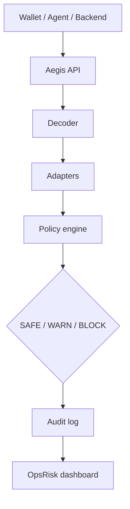

# Aegis RPC


Programmable pre-broadcast transaction screening for Base Sepolia (and the same pattern on other EVM chains).

Aegis is a JSON-RPC-shaped gateway and preflight API for wallets, agents, keepers, and backends: read-only calls pass through; risky sends are decoded, checked against deterministic policy plus adapter signals, and return `SAFE`, `WARN`, or `BLOCK` before broadcast.

**AI explains. Policy decides.** AI memos and assist text run after deterministic context exists; they do not replace the verdict engine.

## Links (fill before submit)

| Artifact | URL |
|----------|-----|
| Live app (Vercel) | `https://web-gamma-bay-96.vercel.app` |
| Base Sepolia policy registry | [0xdd59…5011 on Basescan](https://sepolia.basescan.org/address/0xdd59bC2E7Ea61E689d16514428DD618cFB825011#code) |
| Demo video | `https://www.youtube.com/watch?v=Heo4iv_3Xas` |

## Judge quick test (~2 min)

**Chain:** Base Sepolia · **chainId** `84532`

### Endpoints (pick one base URL)

| Use | URL |
|-----|-----|
| **JSON-RPC** (wallet / `cast` / agents) | `https://web-gamma-bay-96.vercel.app/api/rpc` or `http://127.0.0.1:3020/api/rpc` |
| **Preflight** | `…/api/preflight` |
| **Audit log** | `…/api/events` |
| **Health** | `…/api/health` |
| **UI — live 3-tx** | `…/demo/live` |
| **UI — dashboard** | `…/dashboard` |

Wallet custom RPC: paste the **JSON-RPC** URL above (same chain). Unsigned sends return `-32090 REQUIRES_PREFLIGHT` until screened.

**RPC smoke (read passthrough):**

```bash
curl -s https://web-gamma-bay-96.vercel.app/api/rpc \
  -H 'Content-Type: application/json' \
  -d '{"jsonrpc":"2.0","id":1,"method":"eth_blockNumber","params":[]}'
```

### Live 3-tx (SAFE / WARN / BLOCK)

Runs three real preflights against deployed Base Sepolia contracts, then you can read the audit trail.

**Production** (replace with your Vercel origin):

```bash
AEGIS_BASE_URL=https://web-gamma-bay-96.vercel.app ./tests/curl-live-three-tx.sh
curl -s "https://web-gamma-bay-96.vercel.app/api/events?limit=5" | jq .
```

**Local** (after `npm run start -- --port 3020` in `apps/web`):

```bash
AEGIS_BASE_URL=http://127.0.0.1:3020 ./tests/curl-live-three-tx.sh
curl -s "http://127.0.0.1:3020/api/events?limit=5" | jq .
```

Expect: `SAFE` (DeFi check) · `WARN` (high approve) · `BLOCK` (unlimited approve). Or click through **`/demo/live`** in the browser.

<details>
<summary>What “live 3-tx” means (optional)</summary>

Three **preflight screenings** (unsigned tx intents), not three auto-mined on-chain txs. Trace results via **`/api/events`** or **`/dashboard`**, not chain log listeners. On-chain `Approval` events only if you later broadcast (e.g. `/demo/wallet` with a connected wallet).
</details>

## Deployed contracts (Base Sepolia, chainId 84532)

**Source verified** on [Basescan](https://sepolia.basescan.org/) and [Blockscout](https://base-sepolia.blockscout.com/) (2026-05-21). Re-verify: `./contracts/scripts/verify-base-sepolia.sh` (needs `ETHERSCAN_API_KEY` from [etherscan.io/apidashboard](https://etherscan.io/apidashboard), chainId 84532).

| Contract | Address | Explorer |
|----------|---------|----------|
| `AegisPolicyRegistry` | `0xdd59bC2E7Ea61E689d16514428DD618cFB825011` | [Basescan](https://sepolia.basescan.org/address/0xdd59bC2E7Ea61E689d16514428DD618cFB825011#code) · [Blockscout](https://base-sepolia.blockscout.com/address/0xdd59bC2E7Ea61E689d16514428DD618cFB825011) |
| `DemoERC20` | `0xba0e8E5CBDD3DC2D3787776298fA524313BAB52E` | [Basescan](https://sepolia.basescan.org/address/0xba0e8E5CBDD3DC2D3787776298fA524313BAB52E#code) · [Blockscout](https://base-sepolia.blockscout.com/address/0xba0e8E5CBDD3DC2D3787776298fA524313BAB52E) |
| `DemoSpender` | `0x29993246fF751a72B43C1B47583822c017691995` | [Basescan](https://sepolia.basescan.org/address/0x29993246fF751a72B43C1B47583822c017691995#code) · [Blockscout](https://base-sepolia.blockscout.com/address/0x29993246fF751a72B43C1B47583822c017691995) |
| `AgentUseCasePolicyApp` | `0x0355bDCAC2A7078E67A223422632C94F1af762A0` | [Basescan](https://sepolia.basescan.org/address/0x0355bDCAC2A7078E67A223422632C94F1af762A0#code) · [Blockscout](https://base-sepolia.blockscout.com/address/0x0355bDCAC2A7078E67A223422632C94F1af762A0) |
| `DeFiUseCasePolicyApp` | `0x320b965A9b79229703548E51c5BCAE9C5769406C` | [Basescan](https://sepolia.basescan.org/address/0x320b965A9b79229703548E51c5BCAE9C5769406C#code) · [Blockscout](https://base-sepolia.blockscout.com/address/0x320b965A9b79229703548E51c5BCAE9C5769406C) |
| `RWAUseCasePolicyApp` | `0x6B41B1d1bFd18be664FC73969B4Dd30323fD025c` | [Basescan](https://sepolia.basescan.org/address/0x6B41B1d1bFd18be664FC73969B4Dd30323fD025c#code) · [Blockscout](https://base-sepolia.blockscout.com/address/0x6B41B1d1bFd18be664FC73969B4Dd30323fD025c) |

On-chain policy IDs (registered at deploy): `default-wallet-policy`, `default-agent-policy` — hashes verifiable via `verifyHash` on the registry.

Artifact: [`contracts/deployments/base-sepolia.json`](contracts/deployments/base-sepolia.json)

Spoken pitch and judging weights: `docs/JUDGE_NARRATIVE.md`. Judge Q&A: `docs/GRILL_QA.md`.

## Demo thesis

1. RPC passthrough (`eth_blockNumber`, `eth_getBalance`)
2. Preflight API with decoded intent
3. Block unlimited ERC20 approvals to unknown spenders
4. Chainlink price/freshness adapter signal
5. OpsRisk dashboard + AI memo (explanation only)

See [HACKATHON.md](HACKATHON.md) for module build order (one commit per module).

## Stack

- Next.js App Router (`apps/web`)
- TypeScript strict, Tailwind, viem, zod
- Target chain: Base Sepolia (84532)

## Quick start

```bash
cp .env.example apps/web/.env.local   # set BASE_SEPOLIA_RPC_URL locally — never commit secrets
cd apps/web && npm install && npm run build
./scripts/smoke-scaffold.sh
```

## Demo (developers)

```bash
cp apps/web/.env.example apps/web/.env.local   # BASE_SEPOLIA_RPC_URL — never commit
cd apps/web && npm install && npm run build && npm run start -- --port 3020
```

More smokes: `./tests/curl-demo.sh`, `./tests/curl-abi-index.sh`, `forge test` in `contracts/`, `npm run sync:abi-index`.

UI: `/demo/agent`, `/demo/wallet`, `/policies`. Do **not** set `NEXT_PUBLIC_AEGIS_FIXTURES` for live screening.

**Deploy + production smoke:** [`docs/LOCAL_DEV.md`](docs/LOCAL_DEV.md) · `AEGIS_PROD_URL=https://web-gamma-bay-96.vercel.app ./tests/curl-production-smoke.sh`

## Architecture (high level)



## Judging alignment (SEABW)

| Criterion | Weight | One-line proof in this repo |
|-----------|--------|------------------------------|
| Originality | 30% | RPC as programmable checkpoint — not wallet-only, not post-broadcast monitoring. |
| Problem-Solving | 30% | Blocks drainer-class `approve` patterns and policy violations before broadcast. |
| Completeness | 20% | `/api/rpc`, `/api/preflight`, adapters, dashboard, audit trail (see HACKATHON modules). |
| Scalability | 20% | Roadmap: Security RPC / preflight → OpsRisk Cloud → managed gateway → adapter marketplace (`docs/JUDGE_NARRATIVE.md`). |

## Security disclaimer

Aegis is a risk-reduction layer: it does not prevent all exploits or detect all zero-days. Policies can be wrong (false positives/negatives); operators tune modes, rules, and adapters. See `docs/GRILL_QA.md` for honest limits.

## API routes

| Route | Purpose |
|-------|---------|
| `POST /api/rpc` | JSON-RPC passthrough + intercept `-32090` |
| `POST /api/preflight` | Transaction screening |
| `POST /api/safe-send` | Broadcast after SAFE/WARN override |
| `GET/POST/PUT /api/policies` | Policy registry (in-memory MVP) |
| `GET /api/ai-analyze?requestId=` | AI memo + pre-signing assist |
| `GET /api/events` | Audit timeline |
| `GET /api/adapters/chainlink` | Feed health |
| `GET /api/health` | Deploy smoke (no upstream RPC call) |
| `GET /api/indexer` | ABI index status (deployed contracts) |
| `/demo/live` | Live 3-tx preflight (SAFE / WARN / BLOCK) |
| `/demo/agent` | LEAD agent preflight demo |
| `/demo/wallet` | Wallet approval firewall |
| `/dashboard` | OpsRisk UI |


## Orchestration

- Hermes Kanban board: `aegis-hackathon`
- Workspace: `dir:/home/asyam/dev/Project/aegis-hackathon-kit/aegis-rpc`
- Dashboard: `hermes dashboard` → http://127.0.0.1:9119
