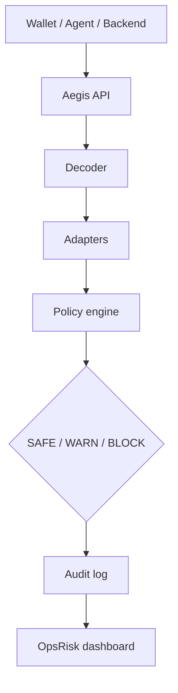

# Aegis RPC


Programmable pre-broadcast transaction screening for Base Sepolia (and the same pattern on other EVM chains).

Aegis is a JSON-RPC-shaped gateway and preflight API for wallets, agents, keepers, and backends: read-only calls pass through; risky sends are decoded, checked against deterministic policy plus adapter signals, and return `SAFE`, `WARN`, or `BLOCK` before broadcast.

**AI explains. Policy decides.** AI memos and assist text run after deterministic context exists; they do not replace the verdict engine.

## Links (fill before submit)

| Artifact | URL |
|----------|-----|
| Live app (Vercel) | https://web-gamma-bay-96.vercel.app |
| Base Sepolia policy registry | [0xdd59…5011 on Basescan](https://sepolia.basescan.org/address/0xdd59bC2E7Ea61E689d16514428DD618cFB825011#code) |
| Demo video | https://www.youtube.com/watch?v=Heo4iv_3Xas |

## Judge terminal test guide

**Chain:** Base Sepolia · **chainId** `84532` · **Production:** [https://web-gamma-bay-96.vercel.app](https://web-gamma-bay-96.vercel.app)

Set once (all curls below use `$AEGIS_BASE`):

```bash
export AEGIS_BASE="https://web-gamma-bay-96.vercel.app"
# optional: git clone <repo> && cd aegis-rpc  # for ./tests/*.sh
```

### One-command scripts

| Goal | Command | Expect |
|------|---------|--------|
| **Full terminal tour** | `AEGIS_BASE_URL=$AEGIS_BASE ./tests/curl-judge-terminal.sh` | Health, RPC, preflight lanes, adapters |
| **3 verdicts only** | `AEGIS_BASE_URL=$AEGIS_BASE ./tests/curl-judge-preflight-only.sh` | `SAFE` / `WARN` / `BLOCK` |
| Maintainer smoke | `AEGIS_PROD_URL=$AEGIS_BASE ./tests/curl-production-smoke.sh` | Fails at `ai-analyze` until Supabase |
| Local full demo | `AEGIS_BASE_URL=http://127.0.0.1:3020 ./tests/curl-demo.sh` | Includes ai-analyze + events (same instance) |

**Browser (no terminal):** [Live 3-tx demo](https://web-gamma-bay-96.vercel.app/demo/live) · [Dashboard](https://web-gamma-bay-96.vercel.app/dashboard) · [Wallet demo](https://web-gamma-bay-96.vercel.app/demo/wallet)

### Production vs local

| Works on Vercel now | Needs local dev or Supabase |
|---------------------|-----------------------------|
| Health, CORS, RPC passthrough & intercept | `GET /api/events` timeline (often `[]` on prod) |
| Batch RPC, `aegis_preflight`, `aegis_preflightUserOp` | `GET /api/ai-analyze?requestId=` cross-request poll |
| REST preflight SAFE / WARN / BLOCK (verdict in response body) | `POST /api/safe-send` broadcast |
| Agent cap BLOCK, serialized tx BLOCK | Full `curl-live-three-tx.sh` (ai-analyze step) |
| Policies, Chainlink adapter, indexer, defender webhook | |

Without Supabase, Vercel serverless stores audit events in **per-instance memory** — preflight JSON is the reliable proof on prod.

### Endpoints

| Use | URL |
|-----|-----|
| **JSON-RPC** (wallet / `cast` / agents) | `$AEGIS_BASE/api/rpc` (local: `http://127.0.0.1:3020/api/rpc`) |
| **Preflight** | `$AEGIS_BASE/api/preflight` |
| **Audit log** | `$AEGIS_BASE/api/events` |
| **Health** | `$AEGIS_BASE/api/health` |
| **Policies** | `$AEGIS_BASE/api/policies` |
| **Chainlink** | `$AEGIS_BASE/api/adapters/chainlink` |
| **Indexer** | `$AEGIS_BASE/api/indexer` |
| **UI — live 3-tx** | `$AEGIS_BASE/demo/live` |
| **UI — dashboard** | `$AEGIS_BASE/dashboard` |

MetaMask custom RPC: `$AEGIS_BASE/api/rpc` (chain 84532). Raw `eth_send*` returns **`-32090 REQUIRES_PREFLIGHT`** until screened.

---

### Copy-paste curls (full capabilities)

#### 1 — Deploy health

```bash
curl -s "$AEGIS_BASE/api/health"
# expect: "ok":true, "chainId":"84532", "rpcEnvSet":true
```

#### 2 — CORS preflight

```bash
curl -s -o /dev/null -w "%{http_code}\n" -X OPTIONS "$AEGIS_BASE/api/rpc" \
  -H "Origin: https://example.com" \
  -H "Access-Control-Request-Method: POST"
# expect: 204
```

#### 3 — RPC read passthrough

```bash
# eth_blockNumber
curl -s "$AEGIS_BASE/api/rpc" -H "Content-Type: application/json" \
  -d '{"jsonrpc":"2.0","id":1,"method":"eth_blockNumber","params":[]}'
# expect: "result":"0x..."

# eth_chainId
curl -s "$AEGIS_BASE/api/rpc" -H "Content-Type: application/json" \
  -d '{"jsonrpc":"2.0","id":2,"method":"eth_chainId","params":[]}'
# expect: "result":"0x14a34" (84532)

# eth_getBalance
curl -s "$AEGIS_BASE/api/rpc" -H "Content-Type: application/json" \
  -d '{"jsonrpc":"2.0","id":3,"method":"eth_getBalance","params":["0x1234567890123456789012345678901234567890","latest"]}'
# expect: "result":"0x..."
```

#### 4 — RPC send gate (`-32090`)

```bash
# eth_sendRawTransaction
curl -s "$AEGIS_BASE/api/rpc" -H "Content-Type: application/json" \
  -d '{"jsonrpc":"2.0","id":4,"method":"eth_sendRawTransaction","params":["0x00"]}'
# expect: "code":-32090, REQUIRES_PREFLIGHT

# eth_sendTransaction
curl -s "$AEGIS_BASE/api/rpc" -H "Content-Type: application/json" \
  -d '{"jsonrpc":"2.0","id":5,"method":"eth_sendTransaction","params":[{"from":"0x0000000000000000000000000000000000000001","to":"0x0000000000000000000000000000000000000002","value":"0x0"}]}'
# expect: "code":-32090
```

#### 5 — ERC-4337 send gate

```bash
curl -s "$AEGIS_BASE/api/rpc" -H "Content-Type: application/json" \
  -d '{"jsonrpc":"2.0","id":6,"method":"eth_sendUserOperation","params":[{"sender":"0x1234567890123456789012345678901234567890","nonce":"0x0","callData":"0x","callGasLimit":"0x1","verificationGasLimit":"0x1","preVerificationGas":"0x1","maxFeePerGas":"0x1","maxPriorityFeePerGas":"0x1"},"0x5FF137D4b0FDCD49DcA30c7CF57E578a026d2789"]}'
# expect: REQUIRES_PREFLIGHT
```

#### 6 — Batch JSON-RPC

```bash
curl -s "$AEGIS_BASE/api/rpc" -H "Content-Type: application/json" -d '[
  {"jsonrpc":"2.0","id":7,"method":"eth_blockNumber","params":[]},
  {"jsonrpc":"2.0","id":8,"method":"eth_sendRawTransaction","params":["0x02"]}
]'
# expect: array — first has result, second has -32090
```

#### 7 — Aegis RPC `aegis_preflight` (BLOCK unlimited approve)

Uses deployed `DemoERC20` + `DemoSpender` (see contracts table below).

```bash
curl -s "$AEGIS_BASE/api/rpc" -H "Content-Type: application/json" \
  -d '{"jsonrpc":"2.0","id":9,"method":"aegis_preflight","params":[{"chainId":84532,"from":"0x1234567890123456789012345678901234567890","to":"0xba0e8E5CBDD3DC2D3787776298fA524313BAB52E","valueWei":"0","data":"0x095ea7b300000000000000000000000029993246ff751a72b43c1b47583822c017691995ffffffffffffffffffffffffffffffffffffffffffffffffffffffffffffffff","policyId":"default-wallet-policy"}]}'
# expect: UNLIMITED_APPROVAL_UNKNOWN_SPENDER in result
```

#### 8 — Aegis RPC `aegis_preflightUserOp`

```bash
curl -s "$AEGIS_BASE/api/rpc" -H "Content-Type: application/json" \
  -d '{"jsonrpc":"2.0","id":10,"method":"aegis_preflightUserOp","params":[{"chainId":84532,"userOperation":{"sender":"0x1234567890123456789012345678901234567890","nonce":"0x0","callData":"0x","callGasLimit":"0x5208","verificationGasLimit":"0x5208","preVerificationGas":"0x5208","maxFeePerGas":"0x1","maxPriorityFeePerGas":"0x1"}}]}'
# expect: verdict JSON (schema path)
```

#### 9 — REST preflight SAFE (DeFi `checkSwapDeviation`)

```bash
curl -s -X POST "$AEGIS_BASE/api/preflight" -H "Content-Type: application/json" \
  -d '{"chainId":84532,"from":"0x1234567890123456789012345678901234567890","to":"0x320b965A9b79229703548E51c5BCAE9C5769406C","valueWei":"0","data":"0x02d235900000000000000000000000001111111111111111111111111111111111111111000000000000000000000000222222222222222222222222222222222222222200000000000000000000000000000000000000000000000000000000000f424000000000000000000000000000000000000000000000000000000000000f424000000000000000000000000000000000000000000000000000000000000000640000000000000000000000000000000000000000000000000000000000000032","policyId":"default-wallet-policy"}'
# expect: "verdict":"SAFE", "reasonCode":"ALL_CHECKS_PASSED"
```

#### 10 — REST preflight WARN (high allowance approve)

```bash
curl -s -X POST "$AEGIS_BASE/api/preflight" -H "Content-Type: application/json" \
  -d '{"chainId":84532,"from":"0x1234567890123456789012345678901234567890","to":"0xba0e8E5CBDD3DC2D3787776298fA524313BAB52E","valueWei":"0","data":"0x095ea7b300000000000000000000000029993246ff751a72b43c1b47583822c01769199500000000000000000000000000000000000000000000d3c21bcecceda1000000","policyId":"default-wallet-policy"}'
# expect: "verdict":"WARN", "reasonCode":"HIGH_ALLOWANCE"
```

#### 11 — REST preflight BLOCK (unlimited approve)

```bash
curl -s -X POST "$AEGIS_BASE/api/preflight" -H "Content-Type: application/json" \
  -d '{"chainId":84532,"from":"0x1234567890123456789012345678901234567890","to":"0xba0e8E5CBDD3DC2D3787776298fA524313BAB52E","valueWei":"0","data":"0x095ea7b300000000000000000000000029993246ff751a72b43c1b47583822c017691995ffffffffffffffffffffffffffffffffffffffffffffffffffffffffffffffff","policyId":"default-wallet-policy"}'
# expect: "verdict":"BLOCK", "reasonCode":"UNLIMITED_APPROVAL_UNKNOWN_SPENDER"
```

#### 12 — Agent policy (transfer over cap)

```bash
curl -s -X POST "$AEGIS_BASE/api/preflight" -H "Content-Type: application/json" \
  -d '{"chainId":84532,"from":"0xA9e15A7d2c0B7F0EaF94c2De27B5C7e1aaF50001","to":"0x036CbD53842c5426634e7929541eC2318f3dCF7e","valueWei":"0","data":"0xa9059cbb000000000000000000000000ae61b5c3b6e9210aa12345678aef0c11b0a0ab00000000000000000000000000000000000000000000000000000000011e1a3000","policyId":"default-agent-policy"}'
# expect: "reasonCode":"AGENT_TX_CAP_EXCEEDED"
```

#### 13 — Serialized unsigned tx (EIP-1559)

```bash
curl -s -X POST "$AEGIS_BASE/api/preflight" -H "Content-Type: application/json" \
  -d '{"serializedTransaction":"0x02f87083014a3480843b9aca00843b9aca00830186a094036cbd53842c5426634e7929541ec2318f3dcf7e80b844095ea7b3000000000000000000000000deadbee5deadbeefdeadbeefdeadbeefdeadbeefffffffffffffffffffffffffffffffffffffffffffffffffffffffffffffffffc0","from":"0x1234567890aBCdef1234567890abcDEf12345678","policyId":"default-wallet-policy"}'
# expect: BLOCK + UNLIMITED_APPROVAL_UNKNOWN_SPENDER
```

#### 14 — Policies registry

```bash
curl -s "$AEGIS_BASE/api/policies"
# expect: policy list with on-chain hash fields
```

#### 15 — Chainlink adapter

```bash
curl -s "$AEGIS_BASE/api/adapters/chainlink"
# expect: feed health (price / stale signal)
```

#### 16 — ABI indexer

```bash
curl -s "$AEGIS_BASE/api/indexer"
# expect: "contractCount": 6 or higher
```

#### 17 — Audit timeline (may be empty on prod)

```bash
curl -s "$AEGIS_BASE/api/events?limit=5"
# expect: {"events":[...]} locally; often {"events":[],"count":0} on Vercel without Supabase
```

#### 18 — AI memo poll (local or Supabase)

```bash
# Run preflight first, copy requestId from response:
REQ_ID="<paste-requestId>"
curl -s "$AEGIS_BASE/api/ai-analyze?requestId=$REQ_ID"
# expect: memo JSON on local; 404 on prod cross-request without Supabase
```

#### 19 — Defender webhook (WARN audit)

```bash
curl -s -X POST "$AEGIS_BASE/api/webhooks/defender" -H "Content-Type: application/json" \
  -d '{"eventName":"SuspiciousApproval","severity":"HIGH","description":"judge curl"}'
# expect: "verdict":"WARN"
```

#### 20 — Foundry `cast` (optional)

```bash
cast block-number --rpc-url "$AEGIS_BASE/api/rpc"
# expect: hex block number
```

<details>
<summary>What “live 3-tx” means</summary>

Three **preflight screenings** (unsigned tx intents), not three auto-mined on-chain txs. Calldata targets deployed Base Sepolia contracts in the table below. Regenerate exact payloads: `node scripts/print-live-calldata.mjs`.
</details>

## Deployed contracts (Base Sepolia, chainId 84532)

**Source verified** on [Basescan](https://sepolia.basescan.org/) and [Blockscout](https://base-sepolia.blockscout.com/) (2026-05-21). Re-verify: `./contracts/scripts/verify-base-sepolia.sh` (needs `ETHERSCAN_API_KEY` from [etherscan.io/apidashboard](https://etherscan.io/apidashboard), chainId 84532).

| Contract | Address | Explorer |
|----------|---------|----------|
| `AegisPolicyRegistry` | `0xdd59bC2E7Ea61E689d16514428DD618cFB825011` | [Basescan](https://sepolia.basescan.org/address/0xdd59bC2E7Ea61E689d16514428DD618cFB825011#code) · [Blockscout](https://base-sepolia.blockscout.com/address/0xdd59bC2E7Ea61E689d16514428DD618cFB825011) |
| `DemoERC20` | `0xba0e8E5CBDD3DC2D3787776298fA524313BAB52E` | [Basescan](https://sepolia.basescan.org/address/0xba0e8E5CBDD3DC2D3787776298fA524313BAB52E#code) · [Blockscout](https://base-sepolia.blockscout.com/address/0xba0e8E5CBDD3DC2D3787776298fA524313BAB52E) |
| `DemoSpender` | `0x29993246fF751a72B43C1B47583822c017691995` | [Basescan](https://sepolia.basescan.org/address/0x29993246fF751a72B43C1B47583822c017691995#code) · [Blockscout](https://base-sepolia.blockscout.com/address/0x29993246fF751a72B43C1B47583822c017691995) |
| `AgentUseCasePolicyApp` | `0x0355bDCAC2A7078E67A223422632C94F1af762A0` | [Basescan](https://sepolia.basescan.org/address/0x0355bDCAC2A7078E67A223422632C94F1af762A0#code) · [Blockscout](https://base-sepolia.blockscout.com/address/0x0355bDCAC2A7078E67A223422632C94F1af762A0) |
| `DeFiUseCasePolicyApp` | `0x320b965A9b79229703548E51c5BCAE9C5769406C` | [Basescan](https://sepolia.basescan.org/address/0x320b965A9b79229703548E51c5BCAE9C5769406C#code) · [Blockscout](https://base-sepolia.blockscout.com/address/0x320b965A9b79229703548E51c5BCAE9C5769406C) |
| `RWAUseCasePolicyApp` | `0x6B41B1d1bFd18be664FC73969B4Dd30323fD025c` | [Basescan](https://sepolia.basescan.org/address/0x6B41B1d1bFd18be664FC73969B4Dd30323fD025c#code) · [Blockscout](https://base-sepolia.blockscout.com/address/0x6B41B1d1bFd18be664FC73969B4Dd30323fD025c) |

On-chain policy IDs (registered at deploy): `default-wallet-policy`, `default-agent-policy` — hashes verifiable via `verifyHash` on the registry.

Artifact: [`contracts/deployments/base-sepolia.json`](contracts/deployments/base-sepolia.json)

Spoken pitch and judging weights: `docs/JUDGE_NARRATIVE.md`. Judge Q&A: `docs/GRILL_QA.md`.

## Demo thesis

1. RPC passthrough (`eth_blockNumber`, `eth_getBalance`)
2. Preflight API with decoded intent
3. Block unlimited ERC20 approvals to unknown spenders
4. Chainlink price/freshness adapter signal
5. OpsRisk dashboard + AI memo (explanation only)

See [HACKATHON.md](HACKATHON.md) for module build order (one commit per module).

## Stack

- Next.js App Router (`apps/web`)
- TypeScript strict, Tailwind, viem, zod
- Target chain: Base Sepolia (84532)

## Quick start

```bash
cp .env.example apps/web/.env.local   # set BASE_SEPOLIA_RPC_URL locally — never commit secrets
cd apps/web && npm install && npm run build
./scripts/smoke-scaffold.sh
```

## Demo (developers)

```bash
cp apps/web/.env.example apps/web/.env.local   # BASE_SEPOLIA_RPC_URL — never commit
cd apps/web && npm install && npm run build && npm run start -- --port 3020
```

More smokes: `./tests/curl-demo.sh`, `./tests/curl-abi-index.sh`, `forge test` in `contracts/`, `npm run sync:abi-index`.

UI: `/demo/agent`, `/demo/wallet`, `/policies`. Do **not** set `NEXT_PUBLIC_AEGIS_FIXTURES` for live screening.

**Deploy + production smoke:** [`docs/LOCAL_DEV.md`](docs/LOCAL_DEV.md) · `AEGIS_PROD_URL=https://web-gamma-bay-96.vercel.app ./tests/curl-production-smoke.sh`

## Architecture (high level)



## Judging alignment (SEABW)

| Criterion | Weight | One-line proof in this repo |
|-----------|--------|------------------------------|
| Originality | 30% | RPC as programmable checkpoint — not wallet-only, not post-broadcast monitoring. |
| Problem-Solving | 30% | Blocks drainer-class `approve` patterns and policy violations before broadcast. |
| Completeness | 20% | `/api/rpc`, `/api/preflight`, adapters, dashboard, audit trail (see HACKATHON modules). |
| Scalability | 20% | Roadmap: Security RPC / preflight → OpsRisk Cloud → managed gateway → adapter marketplace (`docs/JUDGE_NARRATIVE.md`). |

## Security disclaimer

Aegis is a risk-reduction layer: it does not prevent all exploits or detect all zero-days. Policies can be wrong (false positives/negatives); operators tune modes, rules, and adapters. See `docs/GRILL_QA.md` for honest limits.

## API routes

See [Judge terminal test guide](#judge-terminal-test-guide) for copy-paste curls.

| Route / method | Purpose |
|----------------|---------|
| `POST /api/rpc` | JSON-RPC passthrough; intercept `eth_send*` / UserOp with `-32090` |
| `POST /api/rpc` · `aegis_preflight` | Screen via JSON-RPC (same engine as REST preflight) |
| `POST /api/rpc` · `aegis_preflightUserOp` | ERC-4337 preflight |
| `POST /api/rpc` · `aegis_sendTransaction` | Broadcast after SAFE/WARN (needs prior preflight + env) |
| `POST /api/preflight` | Transaction screening → `SAFE` / `WARN` / `BLOCK` |
| `POST /api/safe-send` | REST broadcast after SAFE/WARN override |
| `GET/POST/PUT /api/policies` | Policy registry (MVP + on-chain hash) |
| `GET /api/ai-analyze?requestId=` | AI memo + pre-signing assist |
| `GET /api/events` | Audit timeline |
| `GET /api/adapters/chainlink` | Chainlink feed health |
| `GET /api/health` | Deploy smoke (no upstream RPC call) |
| `GET /api/indexer` | ABI index / deployed contract status |
| `POST /api/webhooks/defender` | External alert → WARN audit event |
| `/demo/live` | Live 3-tx preflight (SAFE / WARN / BLOCK) |
| `/demo/agent` | LEAD agent preflight demo |
| `/demo/wallet` | Wallet approval firewall |
| `/dashboard` | OpsRisk UI |


## Orchestration

- Hermes Kanban board: `aegis-hackathon`
- Workspace: `dir:/home/asyam/dev/Project/aegis-hackathon-kit/aegis-rpc`
- Dashboard: `hermes dashboard` → http://127.0.0.1:9119
